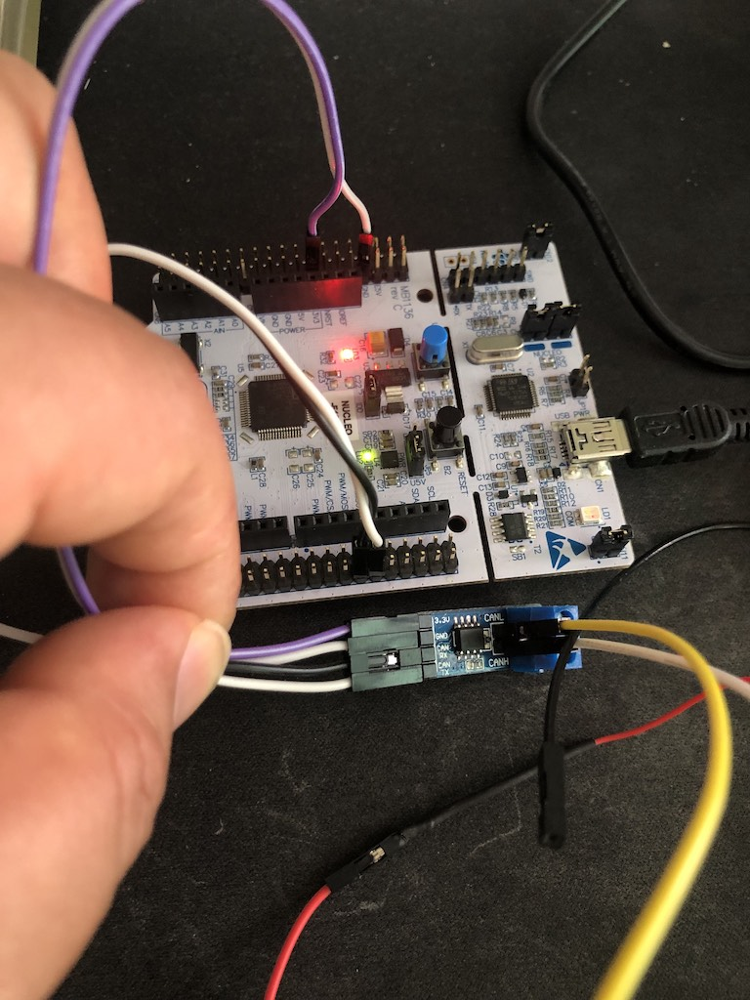
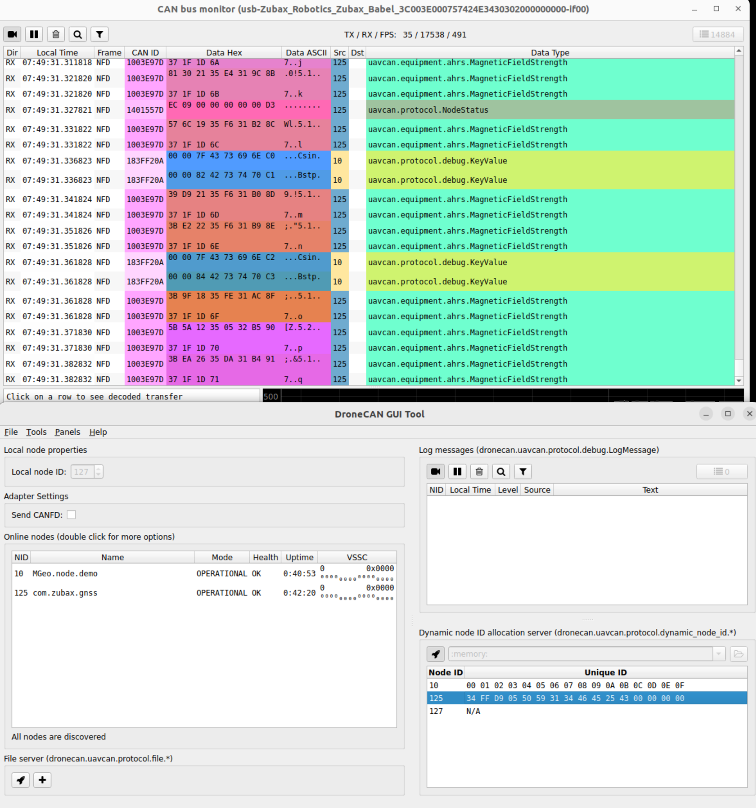
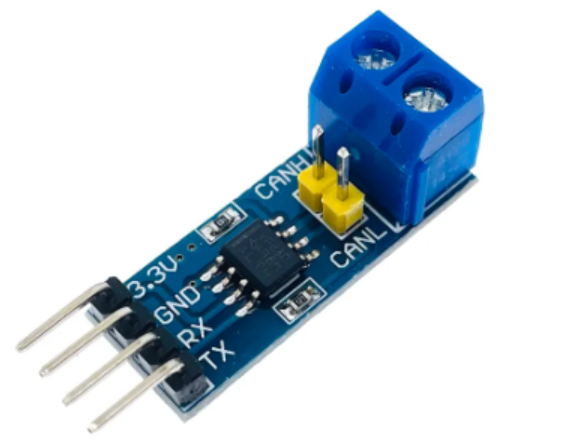

# UAVCAN-for-STM32-Arduino




## 개발 환경
* HW
    * NUCLEO-F103RB
    * can transceiver(SN65HVD230)
    * Zubax Babel
* SW
    * Arduino IDE
    * [Dronecan GUI Tool](https://dronecan.github.io/GUI_Tool/Overview/)

## 연결
* NUCLEO-F103RB



   * 전원 : 3.3V
   * GND
   * CAN_RX : PA_12 (CAN1_RD)
   * CAN_TX : PA_11 (CAN1_TD)

## 소스 다운받기
```bash
git clone https://github.com/jeyong/UAVCAN-for-STM32-Arduino.git 
```

## Arduino IDE 설정 (Windows 10 및 Linux)

* File -> Preference -> "Additional Boards Managers URLs" -> https://github.com/stm32duino/BoardManagerFiles/raw/main/package_stmicroelectronics_index.json
* Tools -> Boards -> Boards Manager -> STM32 MCU based boards -> Install
* Tools -> Boards -> STM32 MCU based board -> Nucleo-64
* Tools -> Boards -> Board part number: -> Nucleo-F103RB
* Tools -> Port -> '아두이노가 연결된 Port 선택(장치관리자에서 확인)'

* STM32CubeProgrammer install
  * [STM32Cube Program](https://www.st.com/en/development-tools/stm32cubeprog.html)
    * zip 다운 받은 후에 압축 풀고 실행

## Arduino 소스코드 열기 및 빌드
* File -> Open -> 소스 다운받은 폴더로 이동 -> libcanard_example 폴더 열기 -> libcanard_example.ino 파일 열기
* 'Verify' 버튼, 'Upload' 버튼

## DronCAN UI로 DroneCAN 매시지 확인 방법
* [실행방법](https://docs.google.com/presentation/d/1F0mcgBMCBcQ-Jt6NjcJWr5dj76pB9ITjcTlpEsEOJIc/edit#slide=id.p)